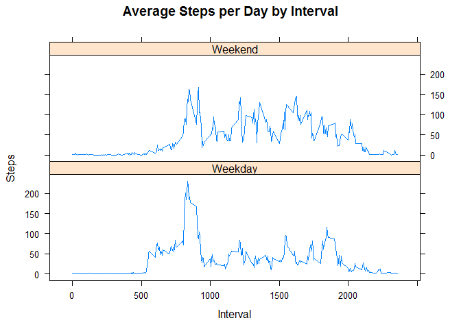

## Introduction

This assignment makes use of data from a personal activity monitoring device. This device collects data at 5 minute intervals through out the day. The data consists of two months of data from an anonymous individual collected during the months of October and November, 2012 and include the number of steps taken in 5 minute intervals each day.

The variables included in this dataset are:

* steps: Number of steps taking in a 5-minute interval (missing values are coded as NA)
*	date: The date on which the measurement was taken in YYYY-MM-DD format
* interval: Identifier for the 5-minute interval in which measurement was taken
The dataset is stored in a comma-separated-value (CSV) file and there are a total of 17,568 observations in this dataset.

## Loading and preprocessing the data

### 1.Loading the the data

First, let's read the CSV file into memory (assuming the activity.csv file is in your current working directory):


```r
df <- read.csv("activity.csv", header=T, sep=",")
```

### 2.Checking the internal structure of the data

Now, we are going to look at the first few observations of the data:


```r
head(df)
```

```
##   steps       date interval
## 1    NA 2012-10-01        0
## 2    NA 2012-10-01        5
## 3    NA 2012-10-01       10
## 4    NA 2012-10-01       15
## 5    NA 2012-10-01       20
## 6    NA 2012-10-01       25
```

Now we want to look at the number of rows and columns of the data set:


```r
nrow(df)
```

```
## [1] 17568
```

```r
ncol(df)
```

```
## [1] 3
```

Let's see the intenal structure of the data:


```r
str(df)
```

```
## 'data.frame':	17568 obs. of  3 variables:
##  $ steps   : int  NA NA NA NA NA NA NA NA NA NA ...
##  $ date    : Factor w/ 61 levels "2012-10-01","2012-10-02",..: 1 1 1 1 1 1 1 1 1 1 ...
##  $ interval: int  0 5 10 15 20 25 30 35 40 45 ...
```

### 3.Transforming the data into suitable format

As we can see the 'date' variable have factor type. For our convenience we will tranform this to date type:


```r
df$date<-as.Date(df$date)
str(df)
```

```
## 'data.frame':	17568 obs. of  3 variables:
##  $ steps   : int  NA NA NA NA NA NA NA NA NA NA ...
##  $ date    : Date, format: "2012-10-01" "2012-10-01" ...
##  $ interval: int  0 5 10 15 20 25 30 35 40 45 ...
```

## What is mean total number of steps taken per day?

### 1.Calculate the total number of steps taken per day

Now we'll calculate total number of steps taken per day:


```r
steps_per_day<-aggregate(df$steps,by=list(df$date),sum)
colnames(steps_per_day)<-c("date","total_steps")
```

Let's take a look at steps taken per day:


```r
head(steps_per_day)
```

```
##         date total_steps
## 1 2012-10-01          NA
## 2 2012-10-02         126
## 3 2012-10-03       11352
## 4 2012-10-04       12116
## 5 2012-10-05       13294
## 6 2012-10-06       15420
```

### 2.Making a histogram of the total number of steps taken each day

now, we are making a histogram to look at the frequency of steps taken each day:


```r
hist(steps_per_day$total_steps,col="orchid2",xlab="Steps Taken",main="Histogram for Total Number of Steps Taken Per Day")
```

<!-- -->

### 3.Calculate and report the mean and median of the total number of steps taken per day

We are going to calculate mean and median of the total number of steps taken per day:


```r
mean_steps<-mean(steps_per_day$total_steps,na.rm = TRUE)
median_steps<-median(steps_per_day$total_steps,na.rm = TRUE)
print(mean_steps)
```

```
## [1] 10766.19
```

```r
print(median_steps)
```

```
## [1] 10765
```


So, The mean of steps taken per day is 10766 (approx.). The median of steps taken per day is 10765. 

## What is the average daily activity pattern?

### 1.Making a time series plot of the 5-minute interval and the average number of steps taken, averaged across all days

We are making a time series plot of the 5-minute interval and average numer of steps taken,avearages across all days. We are using base graphic system to make the plot.


```r
average_steps <- aggregate(df$steps, by=list(df$interval), FUN=mean, na.rm=T)
plot( x=average_steps[,1], 
      y=average_steps[,2], 
      type="l",
      col="blue",
      main="Average steps taken per Interval",
      ylab="Steps taken", 
      xlab="Interval")
```

<!-- -->


### 2.Which 5-minute interval, on average across all the days in the dataset, contains the maximum number of steps?

Let's look at which 5-minute interval, on average across all the days in the dataset, contains the maximum number of steps:


```r
maxinterval <- average_steps[which.max(average_steps[,2]),1]
print(maxinterval)
```

```
## [1] 835
```

So, The interval with the maxium number of steps across all days is 835.

## Imputing missing values

There are many days/intervals where there are missing values (coded as `NA`). The presence of missing days may introduce bias into some calculations or summaries of the data.

### 1.Calculating and reporting the total number of missing values in the dataset


```r
total_na<-sum(is.na(df))
print(total_na)
```

```
## [1] 2304
```

There are 2304 missing values in the dataset.

### 2.Filling in all of the missing values in the dataset

For filling in the missing values, we match Intervall IDs and use the mean steps across all days for a given interval to populate the NAs in the newly created clean dataframe:


```r
df<- cbind(df, average_steps[,2])
names(df)[4] <- c("mean_steps")
df$steps <- ifelse( is.na(df$steps), df$mean_steps, df$steps)
total_na<-sum(is.na(df))
print(total_na)
```

```
## [1] 0
```

So as we can see, there is no missing value in this dataset.

### 3.Creating a new dataset that is equal to the original dataset but with the missing data filled in


```r
new_df<-df[,1:3]
head(new_df)
```

```
##       steps       date interval
## 1 1.7169811 2012-10-01        0
## 2 0.3396226 2012-10-01        5
## 3 0.1320755 2012-10-01       10
## 4 0.1509434 2012-10-01       15
## 5 0.0754717 2012-10-01       20
## 6 2.0943396 2012-10-01       25
```

### 4.Makeing histogram of the total number of steps taken each day and Calculating and reporting the mean and median total number of steps taken per day on the new dataset


```r
steps_per_day<-aggregate(new_df$steps,by=list(new_df$date),sum)
colnames(steps_per_day)<-c("date","total_steps")
head(steps_per_day)
```

```
##         date total_steps
## 1 2012-10-01    10766.19
## 2 2012-10-02      126.00
## 3 2012-10-03    11352.00
## 4 2012-10-04    12116.00
## 5 2012-10-05    13294.00
## 6 2012-10-06    15420.00
```

```r
hist(steps_per_day$total_steps,col="orchid2",xlab="Steps Taken",main="Histogram for Total Number of Steps Taken Per Day")
```

<!-- -->

```r
mean_steps<-mean(steps_per_day$total_steps,na.rm = TRUE)
median_steps<-median(steps_per_day$total_steps,na.rm = TRUE)
print(mean_steps)
```

```
## [1] 10766.19
```

```r
print(median_steps)
```

```
## [1] 10766.19
```

So, as we can see these values does not hugely differ from the estimates from the first part of the assignment but thehistogram  frequency is little higher than the first part of the assignment.Also the median value is slightly higher.

After imputting missing values the total number of steps are almost same as efore. The only difference is if there was a missing value is one row in the previous dataset, in this dataset those values are replaced by a numeric value which is equal to mean steps across all days for that given interval.

## Are there differences in activity patterns between weekdays and weekends?

### 1.	Creating a new factor variable in the dataset with two levels - "weekday" and "weekend" indicating whether a given date is a weekday or weekend day

First, let's create a factor variable indicating whether a given date is a weekday or weekend day in the imputted dataset:


```r
weekdays <- c("Monday", "Tuesday", "Wednesday", "Thursday", "Friday")
new_df$weektime = as.factor(ifelse(is.element(weekdays(as.Date(new_df$date)),weekdays), "Weekday", "Weekend"))
head(new_df)
```

```
##       steps       date interval weektime
## 1 1.7169811 2012-10-01        0  Weekday
## 2 0.3396226 2012-10-01        5  Weekday
## 3 0.1320755 2012-10-01       10  Weekday
## 4 0.1509434 2012-10-01       15  Weekday
## 5 0.0754717 2012-10-01       20  Weekday
## 6 2.0943396 2012-10-01       25  Weekday
```

### 2. Creating a panel plot of the 5-minute interval and the average number of steps taken, averaged across all weekday days or weekend days:


```r
steps_by_interval_day <- aggregate(steps ~ interval + weektime, new_df, mean)
library(lattice,quietly = T)
xyplot(steps_by_interval_day$steps ~ steps_by_interval_day$interval|steps_by_interval_day$weektime, main="Average Steps per Day by Interval",xlab="Interval", ylab="Steps",layout=c(1,2), type="l")
```

<!-- -->

